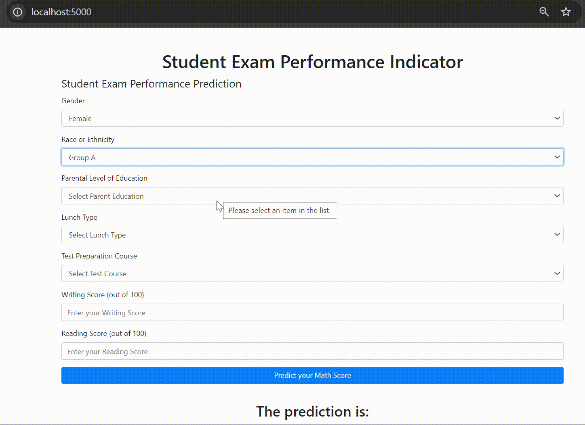

# 7-Days-End-To-End-ML-Project-With-Deployment

- [Description](#description)
- [Prerequisite](#prerequisite)
- [Instructions](#instructions)
- [Project Structure](#project-structure)
- [Resources](#resources)

## Description
This project is an implementation of a YouTube tutorial [7-Days-End-To-End-ML-Project-With-Deployment](https://www.youtube.com/watch?v=S_F_c9e2bz4&list=PLZoTAELRMXVPS-dOaVbAux22vzqdgoGhG) that aims to develop a machine learning model to predict student math scores. It is built using a modular design, allowing for easy extension and modification of different components, such as data processing, model training, and evaluation.

[Dataset in kaggle](https://www.kaggle.com/datasets/rkiattisak/student-performance-in-mathematics/data)
### Steps
1. Set up the project structure, including components such as logger, exception handling, requirements, etc.
2. Prepare the dataset using the data_ingestion component.
3. Apply data transformation techniques.
4. Train multiple regression models (e.g., boosting, trees, linear regression).
5. Perform hyperparameter tuning using grid search.
6. Build a prediction pipeline and integrate it with a Flask app.
7. Create a Dockerfile for containerization.

### Results
  Best model found is Linear Regression with R2 score of 0.88

## Prerequisite
1. Install Python version 3.8

## Instructions:
1. Create a Virtual Environment
   - `python -m venv venv `
   - for windows run `venv\Scripts\activate` 
2. Install all dependencies listed in requirements.txt:
   - `pip install -r requirements.txt`
4. Start the Flask web application by running
   `python app.py`
5. Open your web browser and go to http://localhost:5000 to interact with the application.

## Project Structure:
The project is organized into well-defined modules, each responsible for a specific aspect of the machine learning pipeline, allowing for easy maintenance and extension.

### 

    .
    ├── notebooks/          #Contains Dataset.csv
    ├── src                    
    └── logger.py            #Implements logging functionality to track the pipeline's execution and diagnose issues.
    └──exception.py          #Handles errors gracefully, ensuring that the pipeline can recover from or report failures effectively.
    └──utils.py              #Contains helper functions that are reused across different modules
    └──components
      └── |data_ingestion.py        #Handles loading and splitting the data into training and test sets.
          |data_transformation.py   #Manages data preprocessing, including scaling and feature engineering.
          |model_trainer.py:        #Contains the logic for training regression models on the prepared data.
    └──pipelines
      └── |train_pipeline.py     #Orchestrates the entire training process.
          |predict_pipeline.py   #Facilitates the prediction process
    ├── templates                #Contains HTML files used to render the web interface
    ├── requirements.txt         #Required Python packages
    ├── app.py                   #Entry point for the Flask web application
    ├── setup.py                 #Build the app as package
    ├── Dockerfile               #Dockerfile for containerizing the application
    └── README.md

## Resources
This project is the result of studying [End To End Data Science Playlist- Get Prepared With Industry Ready Projects](https://www.youtube.com/watch?v=S_F_c9e2bz4&list=PLZoTAELRMXVPS-dOaVbAux22vzqdgoGhG
)

